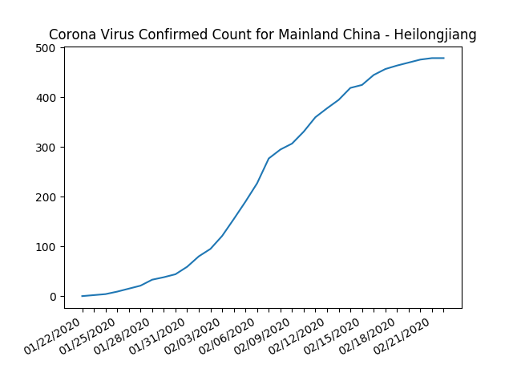
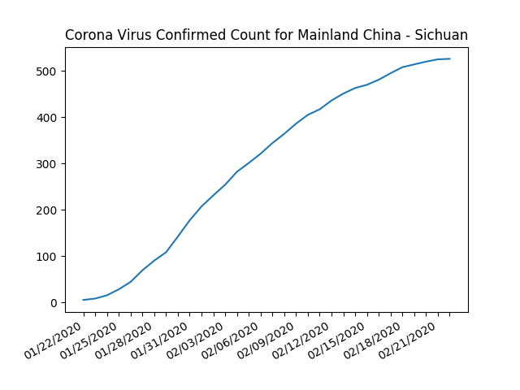
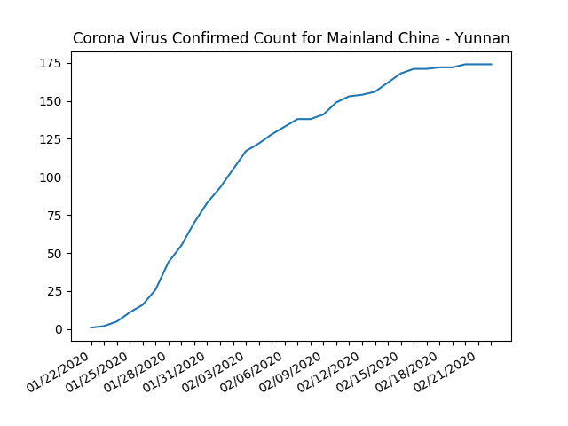

# Taking a Deep Look Into the Outbreak of Corona Virus

The purpose of this paper is perform data analysis on the data set ***Novel Corona Virus 2019*** to gather insights on the outbreak of the Corona Virus to date(2/22/2020).

## Data Set
**Dataset Citation:**
Kaggle.com. (2020). _Novel Corona Virus 2019 Dataset_. [online] Available at: https://www.kaggle.com/sudalairajkumar/novel-corona-virus-2019-dataset [Accessed 1 Mar. 2020].

To begin our analysis, let's take a look at the schema of the dataset, the format is as follows

SNo|ObservationDate|Province/State|Country/Region|Last Update|Confirmed|Deaths|Recovered
| --- | --- | --- | --- | --- | --- | --- | --- |
1|01/22/2020|Anhui|Mainland China|1/22/2020 17:00|1.0|0.0|0.0
2|01/22/2020|Beijing|Mainland China|1/22/2020 17:00|14.0|0.0|0.0
3|01/22/2020|Chongqing|Mainland China|1/22/2020 17:00|6.0|0.0|0.0


## Taking a Look at the Impact for All Countries
Since the data for each province is not present in all dates(some provinces were not continuiously recordered for all dates), we can not simply get the last date(2/22/2020) and aggregate the values on that date, instead let's get the last entry for each province and aggregate confirmed # for the provinces; we can safely assume the last entry for each province is the latest date for the last recorded.

From the chart below, we already see some interesting findings. Mainland China accounts for 98% of the all Corona Virus cases and others(which construct of Diamond Princess cruise ship and Cruise Ship) account for 0.89% of overall case. We can already tell China already had an severe outbreak, and investigating further could give us some useful information about how the outbreak will look like.

```python
# let's aggregate by the country instead of province  
df_by_country = df.groupby(['Country/Region', 'Province/State']).last()\  
                  .groupby(level=0).sum()[['Confirmed', 'Deaths', 'Recovered']]  
df_by_country['Confirmed %'] = df_by_country['Confirmed'] / sum(df_by_country['Confirmed']) * 100  
df_by_country['Death Ratio %'] = df_by_country['Deaths'] / df_by_country['Confirmed'] * 100  
print(df_by_country)
```

Country/Region|Confirmed|Deaths|Recovered|Confirmed %|Death Ratio %
| --- | --- | --- | --- | --- | --- |
Australia|22.0|0.0|11.0|0.028269|0.000000
Canada|12.0|0.0|3.0|0.015420|0.000000
Germany|5.0|0.0|0.0|0.006425|0.000000
Hong Kong|69.0|2.0|6.0|0.088663|2.898551
Israel|1.0|0.0|0.0|0.001285|0.000000
Lebanon|1.0|0.0|0.0|0.001285|0.000000
Macau|10.0|0.0|6.0|0.012850|0.000000
Mainland China|76922.0|2441.0|22687.0|98.842245|3.173344
Others|695.0|2.0|1.0|0.893052|0.287770
Taiwan|26.0|1.0|2.0|0.033409|3.846154
US|60.0|0.0|5.0|0.077098|0.000000


## Taking a Look at the Impact Excluding Mainland China and the Cruises
Since Mainland China and Others(Cruises) contain the most confirmed Corona Viruse cases, we can take a more detailed look at that later. Let's first take a breif look at some of the other impacted countries that also has the potential to outbreak. These contries include and in order of # confirmed cases: Hong Kong, US, Taiwan, Australia, Canada, Macau, Germany, Israel, and Lebanon.
```python
# plot bar graph and pie chart for confirmed case of corona virus distribution excluding the cruises and china  
df_by_country_excl = df_by_country[~df_by_country.index.isin(['Others', 'Mainland China'])]  
x, y = list(df_by_country_excl.index), list(df_by_country_excl['Confirmed'])  
  
plt.subplots()  
plt.title("Corona Virus Geographic Distribution(Excluding China and Cruises)")  
plt.barh(x, y)  
plot_grap()  
  
plt.subplots()  
plt.title("Corona Virus Geographic Distribution(Excluding China and Cruises)")  
patches, texts = plt.pie(y)  
plt.legend(patches, x, loc=4)  
plt.axis('equal')  
plot_grap()
```

<p float="left">
  
   
</p>


## Taking a look at the Impact of Each Province in Mainland China and the Cruises

Let's investigate further at each of the provinces at Mainland China and Cruises to get a general idea of what an outbreak would look like.

A pattern is slowly emerging, let's aggregate the charts to see if what 


```python
# plot distribution of corona virus for china and the cruises; individually as well as the aggregated graph  
for region in ["Others", "Mainland China"]:  
    df_selected_region = df[df['Country/Region'] == region]  
    provinces = df_selected_region['Province/State'].unique()  
    x = y = None  
  
  def format_ticks(value, tick_number):  
        return x[tick_number] if tick_number % 3 == 0 else ""  
  
  for province in provinces:  
        fig, ax = plt.subplots()  
        df_by_prov = df[df['Province/State'] == province].ffill()  
        x, y = list(df_by_prov['ObservationDate']), list(df_by_prov['Confirmed'])  
        plt.plot(x, y)  
        fig.autofmt_xdate()  
        ax.xaxis.set_major_formatter(plt.FuncFormatter(format_ticks))  
        plt.title("Corona Virus Confirmed Count for %s - %s" %(region, province))  
        plot_grap()
```

<p float="left">
   
   
   
   
   
   
   
   
   
   
   
   
   
   
   
   
   
   
   
   
   
   
   
   
   
   
   
   
   
   
   
   
   
</p>


there are 3 visible stages in the graphs:
1) in the initial period, the growth is exponencial
<!--stackedit_data:
eyJoaXN0b3J5IjpbLTEyODc1ODE2NDAsLTYwMTYwMTYwLDE4MT
c1NTAzOTEsMTE2MDE2MDQyOSwtMTQyNjYxMTM4MSwtMTY5MDk5
ODcwMSwtMjkyNDUzNjEsOTIwMjQxMzc3LDEwNTcwNzg2NzddfQ
==
-->